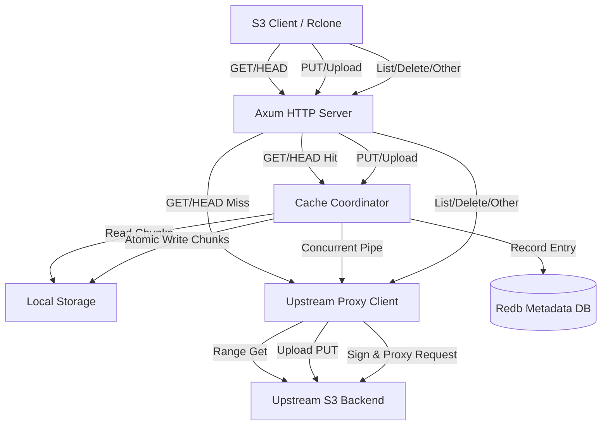

# s3xc - High-Performance S3 Caching Proxy

`s3xc` is a high-performance S3 caching proxy and server written in Rust, designed to replace `rclone`'s VFS caching and serving features with superior performance, absolute efficiency, and a simplified configuration model.

## Features

- **High-Performance S3 Serving**: Native S3 API serving built on top of Axum and Hyper v1.0, leveraging Tokio's multi-threaded runtime.
- **Cache-On-Write-Only Policy**: 
  - Caches files on disk *only* during write operations (uploads/PUTs).
  - GET/HEAD requests serve from cache if available (hits).
  - Cold reads (cache misses) stream directly from upstream S3 without disk write overhead, avoiding cache pollution and reducing disk wear.
  - Overwrites (PUTs) replace cache files and make them hot again.
- **Dynamic S3 Signatures Verification**: Fully supports standard AWS Signature Version 4 (SigV4) verification via both HTTP Headers (Authorization) and Query Parameters (Presigned URLs). Bypassed by default for local trusted networks (no clunky keys configuration needed).
- **Atomic Block/Chunk Storage**: Files are stored as logical chunks (default 8MB) partitioned by SHA256 hashes of the object keys. Writes are atomic (via temporary files and renaming) to prevent corruption.
- **Redb Metadata Store**: Pure-Rust, transactional key-value database tracks cached chunks and object metadata with ACID guarantees.
- **LRU Cache Eviction**: Background thread monitors cache size and automatically evicts oldest chunks once the maximum size limit is reached.
- **Transparent Fallback Proxy**: Listing, bucket creation, deletes, and multipart uploads are dynamically signed and proxied directly to the upstream S3 backend.

---

## Architecture Design

---

## Configuration & Environment Variables

`s3xc` can be configured via environment variables or a TOML configuration file:

| Variable | Description | Default |
|----------|-------------|---------|
| `S3C_BIND_ADDR` | Address/Port to bind the local S3 server | `127.0.0.1:8080` |
| `S3C_UPSTREAM_ENDPOINT` | Upstream S3 endpoint URL (e.g. AWS, MinIO, Cloudflare R2) | *Required* |
| `S3C_UPSTREAM_REGION` | Upstream S3 region | `us-east-1` |
| `S3C_CACHE_DIR` | Disk path for storing cached chunks and database | `./cache` |
| `S3C_CHUNK_SIZE` | Size of each file chunk in bytes | `8388608` (8MB) |
| `S3C_MAX_CACHE_SIZE` | Maximum disk space allocated for cache in bytes | `53687091200` (50GB) |
| `S3C_ACCESS_KEY` | Server-side access key for client signature verification | *Optional* |
| `S3C_SECRET_KEY` | Server-side secret key for client signature verification | *Optional* |

---

## Directory Structure

- [src/main.rs](file:///home/stdpi/repo/s3c/src/main.rs): Setup, CLI parser, database initialization, and daemon launcher.
- [src/config.rs](file:///home/stdpi/repo/s3c/src/config.rs): Application configurations and CLI schema.
- [src/server/](file:///home/stdpi/repo/s3c/src/server/): Axum server, S3 API endpoints, and middleware.
  - [mod.rs](file:///home/stdpi/repo/s3c/src/server/mod.rs): Router configuration and TCP binding.
  - [handlers.rs](file:///home/stdpi/repo/s3c/src/server/handlers.rs): HTTP handlers for GET, HEAD, PUT, and Fallback S3 Proxying.
  - [s3_api.rs](file:///home/stdpi/repo/s3c/src/server/s3_api.rs): Custom SigV4 Header and Query parser and verifier.
- [src/proxy/](file:///home/stdpi/repo/s3c/src/proxy/): Upstream integration layer.
  - [mod.rs](file:///home/stdpi/repo/s3c/src/proxy/mod.rs): Upstream S3 client connection pool, Range reads, and generic request signing.
- [src/cache/](file:///home/stdpi/repo/s3c/src/cache/): VFS caching subsystem.
  - [mod.rs](file:///home/stdpi/repo/s3c/src/cache/mod.rs): Coordinator for reads, writes, and single-flight request coalescing.
  - [storage.rs](file:///home/stdpi/repo/s3c/src/cache/storage.rs): Handles atomic file writes, seeks, and partition hashing on disk.
  - [metadata.rs](file:///home/stdpi/repo/s3c/src/cache/metadata.rs): redb database schema for caching.
  - [policy.rs](file:///home/stdpi/repo/s3c/src/cache/policy.rs): Background LRU eviction worker thread.
- [src/utils.rs](file:///home/stdpi/repo/s3c/src/utils.rs): Shared types and S3 XML error converters.

## Performance Guarantees

1. **Zero-Copy Memory Footprint**: Buffers use reference-counted `bytes::Bytes` passing, avoiding heap allocations as bytes traverse from socket to disk or upstream.
2. **Stream Demuxing (Tee)**: Concurrent uploads stream bytes into S3 and write chunk blocks to disk in a single pass over client data.
3. **Atomic Renames**: Writes to disk occur in temporary `.tmp` files on the same filesystem and are finalized via atomic renames (`fs::rename`), protecting the cache from partial file corruption due to crashes or network failures.
4. **Single-Flight Coalescing**: Watch channels prevent concurrent reads of identical uncached ranges from triggering double downloads from upstream, protecting upstream bandwidth.
